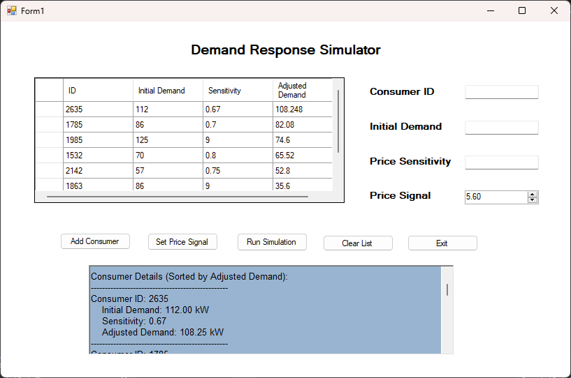

# Demand Response Simulation GUI

This project is a Windows Forms Application that simulates demand response in a smart grid. Users can add consumers, set a price signal, and run simulations to adjust consumer demands based on their price sensitivities.

## Features

- **Add Consumer**: Input consumer details (ID, initial demand, price sensitivity).
- **Set Price Signal**: Adjust price signal to simulate market conditions.
- **Run Simulation**: Calculates adjusted demand for each consumer.
- **Clear Data**: Clears all consumers and simulation results.
- **Exit**: Closes the application.

## Input Constraints

- **Consumer ID**: Positive integer (must be unique).
- **Initial Demand (kW)**: A number between `0.1` and `1000`.
- **Price Sensitivity**: A number between `0.0` and `1.0`.
- **Price Signal**: A positive number.

## Instructions

1. Start the application.
2. Add consumers by providing valid inputs for **Consumer ID**, **Initial Demand**, and **Price Sensitivity**.
3. Set the **Price Signal** using the input box or spinner.
4. Click **Run Simulation** to adjust consumer demands based on the price signal.
5. View detailed results in the table and results box.
6. Use **Clear List** to reset all data or **Exit** to close the application.

## Screenshots



## How It Works

### Data Handling
- Consumer details are stored in a list of `Consumer` objects.
- The `Consumer` class contains:
  - `ID`: Consumer ID.
  - `InitialDemand`: The starting demand in kW.
  - `Sensitivity`: The consumer's sensitivity to price changes.
  - `AdjustedDemand`: The demand after applying the price signal.

### Simulation
- Each consumer's adjusted demand is calculated by reducing the initial demand based on the price signal and their sensitivity.
- The results are sorted by adjusted demand and displayed in the table and output box.

## Validation

The application includes robust input validation:
- Prevents duplicate consumer IDs.
- Enforces range checks for initial demand, price sensitivity, and price signal.

## Usage

Clone this repository and build the project in Visual Studio. Run the application to start simulating demand response scenarios.

```bash
git clone https://github.com/your-username/demand-response-simulation-gui.git
```


## License
This project is licensed under the MIT License. See the LICENSE file for details.

## Contributing
Contributions are welcome! Please open an issue or submit a pull request for bug fixes or feature enhancements.

## Contact
For any questions or support, feel free to contact the developer:HEXMAN-12


